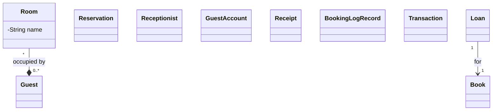

# Assignment 1

## Notes

- boutique hotel
- Rooms
  - three room types: standard rooms, deluxe rooms and suite
  - rooms have different statuses: available, reserved, occupied, under maintenance.
  - Once a guest checks in for their reservation the room is marked as occupied and marked as active stay (Meaning occupied?)
  - Once a guest checks out the room is returned to available or maintenance (if the room is flagged for cleaning or repair)
  - Guests must receive a receipt at check-out showing total charge

- guest can make reservation via calling, emailing, or walking in
- once a guest makes a reservation they receive a confirmation via their reservation method (phone call receive text confirmation)
- A reservation holds a room for specific dates
- A guest can have multiple reservations but a reservation have one guest
- Staff requirements
  - Staff need to have the ability to see which rooms are available for a given date range
  - Staff must be able to see which guests are currently checked in
  - Staff must have the ability to see which reservations are upcoming (same day? Or next 24 hours?)

- Viable entities list
  - Guest, Room, Reservation, Receipt, Confirmation, GuestAccount, BookingLogRecord, Receptionist

## Entity Inventory

- Room Entity
  -  This is a room that is reservable to guests
  - This entity stores information about the nightly rate, a unique identifier tha separates itself from other rooms that is not its number, a reality represented room number, a type of room it is, it's current status, and number of beds
  -  Room is a entity because it holds information that is closely related with itself and is not just a room and it's price but also holds information about it state.
- Guest Entity
  - This is a guest of the boutique hotel
  - the guest knows it's name, could give a phone number and/or email, preffered payment method, and number of occupied party under them.
  - The guest entity is definitely an entity due to how strong of a identity it owns for iteself and can be inquired upon for it's current information
- Reservation Entity
  - this is a reservation for a room in the boutique hotel
  - the reservation holds information for the room id, the date it was reserved, the reserved check in date, the planned check out date, the guest account id, reservation status, and preffered payment method.
  - I believe the reservation is a entity because of it's strong identity unique to itself along with having relationships with the guest and room entity.
- Receptionist Enity
  - this is a receptionist of the boutique hotel 
  - the entity has information about itself such as name, unique identifier, working location, and auth such as username and password.
  - I believe this is a necessary entity as the receptionist is the primary actor with any software for the hotel and has a strong identity with it's information not belonging with any other entity.
- Guest Account Entity
- Receipt Entity
- Booking Log Record Entity
- Transaction Entity

