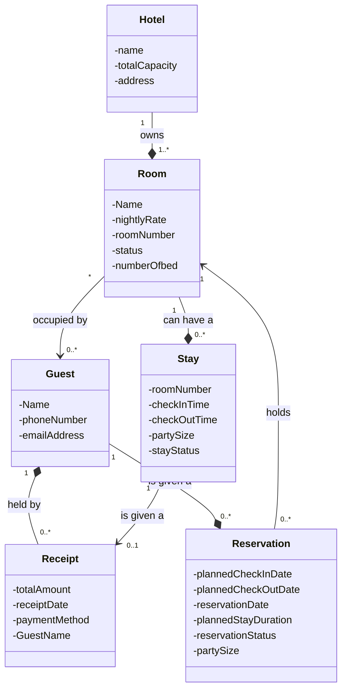
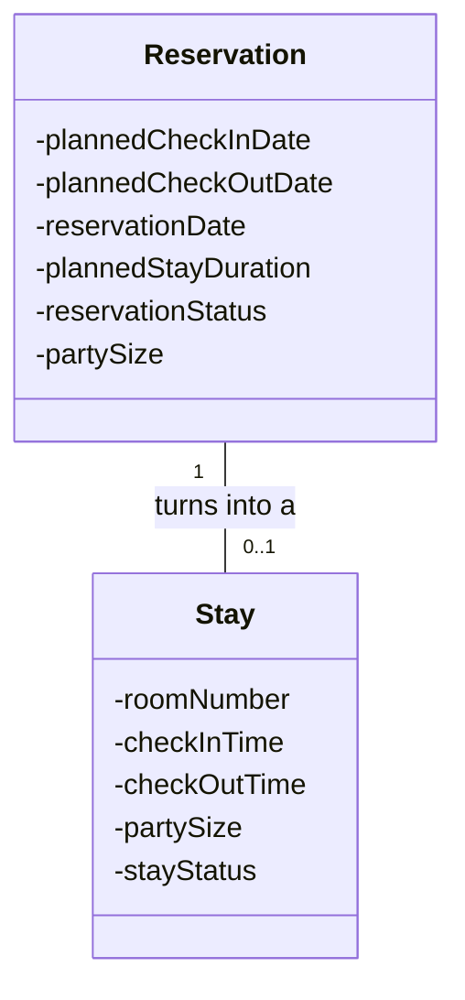

# Assignment 1

## Notes

- boutique hotel
- Rooms
  - three room types: standard rooms, deluxe rooms and suite
  - rooms have different statuses: available, reserved, occupied, under maintenance.
  - Once a guest checks in for their reservation the room is marked as occupied and marked as active stay (Meaning occupied?)
  - Once a guest checks out the room is returned to available or maintenance (if the room is flagged for cleaning or repair)
  - Guests must receive a receipt at check-out showing total charge

- guest can make reservation via calling, emailing, or walking in
- once a guest makes a reservation they receive a confirmation via their reservation method (phone call receive text confirmation)
- A reservation holds a room for specific dates
- A guest can have multiple reservations but a reservation have one guest
- Staff requirements
  - Staff need to have the ability to see which rooms are available for a given date range
  - Staff must be able to see which guests are currently checked in
  - Staff must have the ability to see which reservations are upcoming (same day? Or next 24 hours?)

- Viable entities list
  - Guest, Room, Reservation, Receipt, Confirmation, GuestAccount, BookingLogRecord, Receptionist


## 1 · Entity Inventory

- Room Entity
  -  This is a room that is reservable to guests
  - This entity stores information about the nightly rate, room number, a type of room it is, it's current status, and number of beds
  -  Room is a entity because each room has its own identity that remains the same even when its attributes change.
- Guest Entity
  - This is a guest of the boutique hotel
  - the guest entity has a name, A phone number, and  email. 
  - The guest entity is definitely an entity that has a identity of its own along with having the ability to be descriable using the unique attributes attatched to each instance of iteself.
- Reservation Entity
  - this is a reservation for a room in the boutique hotel
  - the reservation holds the planned check in date, the date the reservation was made, the planned check out date, the planned stay duration in days, reservation status, and party size.
  - I believe the reservation is an entity with its own identity while changeable remains the same idenity of itself.
- Hotel Entity
  - this is a repersentation of the hotel
  - the entity has information about itself such as name, address, and total capacity.
  - I believe this is an entity where each instance has its own identy that stay the same despite attribute changes even thought this assignment is about one hotel the software might be reused for expansion.
- Stay Entity
  - This entity is the active stay the a guest checked in would have
  - this entity holds information about room number, begin date, end date, party size, and stay status
  - The stay entity has a strong identity staying the same even when attributes such as staying date changes.
- Receipt Entity
  - This a receipt given to a guest once checking out
  - paymentMethod, total amount for stay, receipt date, guestName
  - The receipt enity is a entity becasue each receipt has its own identity even if its information were to change.

## 2 · Domain Model Diagram



## 3 · Detailed Use Case

### Scenario: A guest arrives to check in for a reservation made three weeks ago

precondition: system is up and running, guest gives correct reservation identifier input, guest is at hotel.

### Main Flow
| Receiptonist Action| System Response |
|---|---|
| 1. Receptionist enters guest reservation information | 2. System looks for the reservation| 
|  | 3. system displays the guests reservation details to receptionist |
| 4. receptionist confirms guest identity |  | 
| 5. receptionist confirms reservation | 6. System creates a stay and changes room status to occupied |
|  | 7. System confirms check-in and displays succesful process to receptionist | 

### Alternative Flow 1: Reservation not found customer error

| Receptionist Action | System Response |
|---|---|
| 2a. Receptionist enters incorrect reservation information provided by the guest. | 2b. System does not find a matching reservation and informs the receptionist. |
| 2c. Receptionist asks the guest to verify their reservation information. | |
| 2d. Receptionist enters the corrected reservation information. | 2e. System searches again and finds the reservation. |
| | Return to Main Flow Step 3: System displays the guest's reservation details to the receptionist. |


### Alternative Flow 2: Reserved room unavailable (under maintenance)

| Receiptonist Action| System Response |
|---|---|
| | 2a. System displays to receptionist that reservation room is unavailable due to its status as udnerm aintenance| 
| 2b. Receptionist notifies guest that their reserved room/rooms are unavailable and asks if they would like to book one of their other available rooms, If not alternative flow ends and does not rejoin main flow|  |
| 2c. Guest asks receptionist to find available rooms to reserve amd gives preffered room type to search for | 2d. System either finds available room type and displays to receptionist or finds room with other luxury type and displays to receptionist | 
| 2e. Receptionist tells guest the available rooms/room and luxury type and customer either chooses one of the returned room or chooses to leave to another hotel. If they choose one of the hotel Receptionist enters the updated reservation information for the room to system  | return to main flow step 6. |

postcondition: A stay is created and the room status is updated to occupied.


## 4 · Specification and Instance

A Reservation represents the plan a guest makes before arriving at the hotel and a Stay represents what actually happens when the guest checked in. A Reservation knows information about what is planned, such as the planned check-in date, planned checkout date, reservation status, and the room being held. A Stay knows about the actual visit, such as the actual check-in time, actual checkout time, actual party size and stay status. Each Stay results from one Reservation.

This is important due to how a Reservation changes to what actually happened during a stay. For example, on September 1, a guest makes a reservation at the hotel for a planned check-in of September 20 at 3:00 PM and a planned checkout of September 23 at 11:00 AM. The guest actually arrives and checks in at 6:30 PM on September 20. Then, instead of leaving on September 23, the guest requests an additional night and actually checks out at 10:00 AM on September 24 so the Stay records what actually happened. This is correct because changing what actually happened should not erase what the guest originally reserved.

If Reservation and Stay were collapsed into one concept, there would be difficulty distinguishing the original booking from the actual visit. Keeping Reservation and Stay separate allows the hotel to answer both what did the guest actually plan to happen and what actually happened during there stay



## 5 · Sequence Diagram

recondition: system is up and running, guest gives correct reservation identifier input, guest is at hotel.

### Main Flow
| Receiptonist Action| System Response |
|---|---|
| 1. Receptionist enters guest reservation information | 2. System looks for the reservation| 
|  | 3. system displays the guests reservation details to receptionist |
| 4. receptionist confirms guest identity |  | 
| 5. receptionist confirms reservation | 6. System creates a stay and changes room status to occupied |
|  | 7. System confirms check-in and displays succesful process to receptionist | 


```mermaid
sequenceDiagram
  actor Receptionist
  participant Reservation
  participant Room
  participant Guest
  participant Stay

  Receptionist ->> Reservation: searchForReservation
  Reservation -->> Receptionist: returnReservationDetails
  Receptionist ->> Guest: matchGuestIdentity
  Receptionist -->> Reservation: confirmReservation
  Reservation ->> Stay: promptsAStayCreation
  Stay->>Stay: creatingStayInformation
  Stay ->> Room: changesRoomStatusToOccupied
  Stay-->>Reservation :StayCreatedSuccesfull
  Reservation ->> Receptionist: check in successfully processes

  ```

  Didn't really change anything about my thinking or model due to creating this sequence diagram under a time crunch bt I believe something other tahn reservation should interact with receptionist maybe a entity like room system. I believe I did a decent job with my domain responsibility choices.
