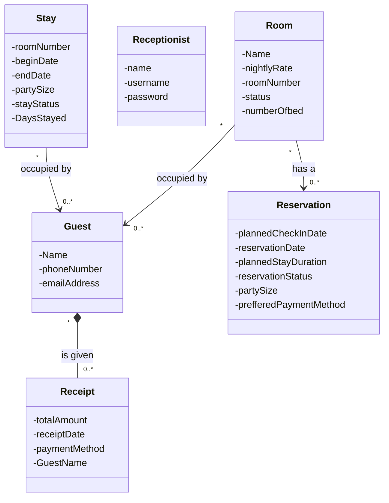

# Assignment 1

## Notes

- boutique hotel
- Rooms
  - three room types: standard rooms, deluxe rooms and suite
  - rooms have different statuses: available, reserved, occupied, under maintenance.
  - Once a guest checks in for their reservation the room is marked as occupied and marked as active stay (Meaning occupied?)
  - Once a guest checks out the room is returned to available or maintenance (if the room is flagged for cleaning or repair)
  - Guests must receive a receipt at check-out showing total charge

- guest can make reservation via calling, emailing, or walking in
- once a guest makes a reservation they receive a confirmation via their reservation method (phone call receive text confirmation)
- A reservation holds a room for specific dates
- A guest can have multiple reservations but a reservation have one guest
- Staff requirements
  - Staff need to have the ability to see which rooms are available for a given date range
  - Staff must be able to see which guests are currently checked in
  - Staff must have the ability to see which reservations are upcoming (same day? Or next 24 hours?)

- Viable entities list
  - Guest, Room, Reservation, Receipt, Confirmation, GuestAccount, BookingLogRecord, Receptionist

## Entity Inventory

- Room Entity
  -  This is a room that is reservable to guests
  - This entity stores information about the nightly rate, room number, a type of room it is, it's current status, and number of beds
  -  Room is a entity because each room has its own identity that remains the same even when its attributes change.
- Guest Entity
  - This is a guest of the boutique hotel
  - the guest entity has a name, A phone number, and  email. 
  - The guest entity is definitely an entity that has a identity of its own along with having the ability to be descriable using the unique attributes attatched to each instance of iteself.
- Reservation Entity
  - this is a reservation for a room in the boutique hotel
  - the reservation holds the planned check in date, the date the reservation was made, the planned check out date, the planned stay duration in days, reservation status, party size, and preffered payment method.
  - I believe the reservation is an entity with its own identity while changeable remains the same idenity of itself.
- Receptionist Enity
  - this is a receptionist of the boutique hotel 
  - the entity has information about itself such as name, Username, and Password
  - I believe this is an entity where each instance has its own identy that stay the same despite attribute changes.
- Stay Entity
  - This entity is the active stay the a guest checked in would have
  - this entity holds information about room number, begin date, end date, party size, and stay status
  - The stay entity has a strong identity staying the same even when attributes such as staying date changes.
- Receipt Entity
  - This a receipt given to a guest once checking out
  - paymentMethod, total amount for stay, receipt date, guestName
  - The receipt enity is a entity becasue each receipt has its own identity even if its information were to change.

