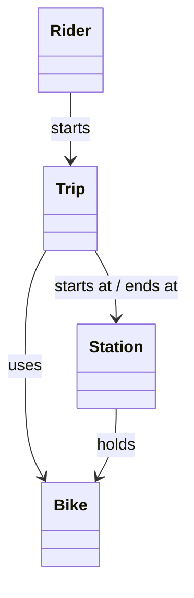

# Individual Sketch — Week 2
**Student: Priya Nair | September 3, 2026**

> **Tonight's problem:** A city is launching a bike-share network. Riders use an app to check out bikes from stations and return them to any station in the network. Trips are billed by duration. Bikes can be reported as damaged mid-ride. Identify the domain objects, their state and behavior, and sketch how they relate.

---

## Entities I see

**Bike**
State: available, checked out, under maintenance
Behavior: get checked out, get returned, get flagged for maintenance
Identity: yes — bike #447 is a specific physical object, not interchangeable with #448

**Station**
State: set of docked bikes, total dock capacity
Behavior: release a bike, accept a returned bike
Identity: yes — Hennepin & 26th is a specific place

**Rider**
State: account info, active trip or not
Behavior: start a trip, end a trip, report a damaged bike
Identity: yes — your account is yours

**Trip**
State: which bike, start station, start time, end station (?), end time, cost
Behavior: begin, end, calculate cost
Identity: yes — trip #88134 is a unique event, not just a process

## How they relate

## Questions I'm sitting with

- Is there a **Dock** object? A station has some number of docks and some number of bikes. Those aren't the same number. "Station has 20 docks, 13 bikes" is different from "dock 7 is jammed and physically won't release a bike." Does a dock matter as its own entity, or is capacity just an integer on Station?

- Does **Bike track its location**, or does **Station track its bikes**? I drew the relationship in both directions and then stopped. If both, they have to stay in sync — that seems like a problem. But if only one, which one and why?

- When a rider **reports damage mid-ride**, what actually happens? Does the Trip end early? Does the Bike get immediately pulled from service? I wrote `flagForMaintenance()` on Bike but I'm not sure who calls it or when.
