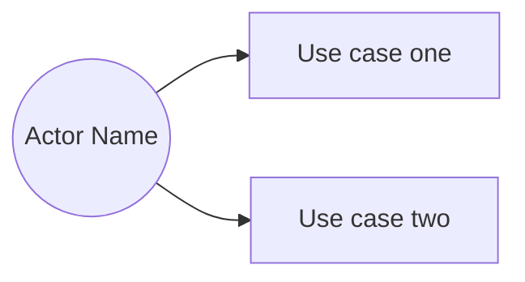

# Use Cases — [Group Name / Number]
### [Course Name] | [Semester]
**Members:** [All member names]
**Last updated:** [Date] — [what changed]

---

*This file lives at `docs/design/use-cases.md`. It is a **living document**.*

*It arrives in two stages. First the diagram and a one-line statement of every use case, which is what your domain model gets audited against. Later, the use cases that carry the most behavior gain full detail.*

*A use case describes what the system does, never how an interface does it. "Customer places an order" is a use case. "Customer clicks the size dropdown" describes a screen that does not exist yet. The test: if someone redesigned every screen tomorrow, would you have to rewrite this? If yes, it is at the wrong altitude.*

*Delete every italic instruction and every bracketed placeholder before you commit.*

---

## 1 · The Use Case Diagram

*Actors and their use cases. An actor is a role, not a person — Barista, not Sam. Not every actor is human.*

---

## 2 · All Use Cases

*Every use case, one line each, grouped by actor. This list must be complete: if you can describe something an actor does with this system that is not here, it is not finished.*

*Once you have a requirements document, note beside each use case which requirement asks for it. A use case with no requirement beside it is either something nobody asked for or something the stakeholder forgot to mention, and knowing which is worth finding out.*

### Customer

- **[UC-C1] [Name]** — [one line: what the customer accomplishes] *[req 2.1]*

### Barista

- **[UC-B1] [Name]** — [one line]

### Manager

- **[UC-M1] [Name]** — [one line]

---

## 3 · Detailed Use Cases

*Repeat this block for each use case that needs full detail.*

*The flow is written as a conversation between the actor and the system: the actor does something, the system responds, the actor does the next thing. Steps are numbered continuously down the table, alternating between the columns. Only one column has content in any given row.*

*Write the system's side as what the system does, not how it does it. "The system shows the items currently available" is a system response. "The system queries the menu table and populates the list view" is implementation.*

*The alternative flows are where the design lives. The main flow is the easy part and is where nothing interesting ever happens — if you cannot think of a single thing that could go wrong, you have not thought about it yet. To find them, walk the main flow and ask at every step what that step assumes, then ask what happens when the assumption is false.*

*An alternative flow branches from a step in the flow. Something that happens out in the world — a carton turns out to be empty, a machine breaks — is not an alternative flow. It reaches the system as an actor doing something, which makes it a use case of its own, or it does not reach the system at all.*

---

### [UC-ID] [Use Case Name]

**Actor:** [primary actor] *[and any secondary actors]*

**Precondition:** [what must be true before this can begin]

**Postcondition:** [what is true afterward that was not true before]

**Main flow**

| Actor Action | System Response |
|---|---|
| 1. [The actor does something.] | |
| | 2. [The system responds.] |
| 3. [The actor does the next thing.] | |
| | 4. [The system responds.] |
| | 5. [And so on, until the postcondition holds.] |

**Alternative flows**

*Each one is keyed to the step in the main flow where it branches. Say where it rejoins, or that it ends the use case.*

**[A1] At step 3 — [what is different this time]**

| Actor Action | System Response |
|---|---|
| 3a. [What the actor does instead.] | |
| | 3b. [How the system responds.] |

*Rejoins the main flow at step 4.* [or: *Ends here; the postcondition does not hold.*]

**[A2] At step [N] — [what goes wrong]**

| Actor Action | System Response |
|---|---|
| | [N]a. [What the system does about it.] |

*[Where it goes.]*

**Assumptions:** [Anything you decided that the requirements did not decide. Cross-reference the entry in `open-questions.md`.]

---

## 4 · Non-Functional Requirements

*Functional requirements are satisfied by the use cases above. Non-functional requirements are not — they say how well the system must do everything rather than what it does, and they get satisfied by decisions about how the application is built.*

*They live here so they are not lost. The ones that constrain the structure of the application get restated as rules in `architecture.md` once that document exists.*

| # | Requirement | What kind | How we would know we met it |
|---|---|---|---|
| [ref] | [what it asks for] | [speed / reliability / usability / platform / security] | [the evidence that would settle it — or "nothing would; this needs a number from the stakeholder"] |

*Watch for two things. A non-functional requirement nobody can check is a wish, not a requirement. And a non-functional requirement often generates functional ones that nobody wrote down — "nothing should ever get lost" is a statement about reliability, and it quietly requires that the system save state and restore it on startup. If it generated a use case, that use case belongs in section 2.*

---

## 5 · Coverage Against the Domain Model

*Every use case must be servable by entities in the domain model. Re-run this whenever either document changes.*

| Use case | Entities it needs | Covered? |
|---|---|---|
| [UC-ID] | [entities that would do the work] | [yes / no — what is missing] |

*Run the check the other way as well: every entity in your domain model should be needed by at least one use case here. An entity nothing needs is either a use case you have not written, or something that was never a domain entity.*
