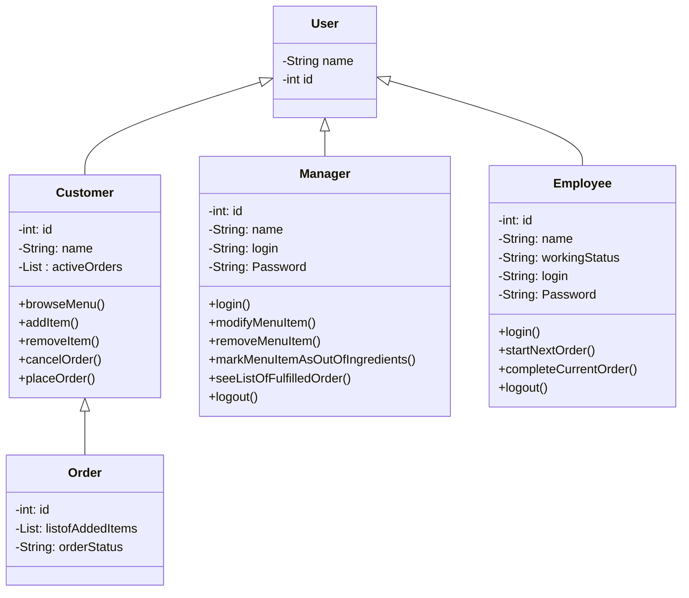

## Thoughts
1.Customers are the first core entity I can think of where its main data involves having a unique id, name identifier,and a list of active orders. Customers should be able to browse a menu, select menu items, customize menu items, add menu items to their orders, remove menu items from their orders, and confirm and place order.

2.Employees are the next core entity where their data involves a unique identifier, name, working status, login information for their work view, and I can't really think about anything else for data that is that important. For operations employees should be able to view a list of pending orders, start working on the next pending order, and mark pending orders as complete.

3.Managers should have again a unique numerical id, names, login information to access/modify menu. Manageres should be able to access menu customization portal, select menu items, add new menu items, temporarily remove items that are out of ingredients, permanently remove items no longer wanted on menu, customize menu availible modifications, pricing, and ingredient costs, and see a list of completed orders.

4.Another core entitiy to the system is the order themselves where they have unique idenitifer, list of menu items, current runnning cost of all menu items, order status. The order entity doesn't really have operations I believe it should just be a data class and another entity handles using the order class to add new menu items or remove new menu items change their status along with the option to completely void the order.

5.Last core entity is the menu item where it's core data involves a unqiue identifier, list of ingredients with their units, status as a menu items. And Once again I think this is primarily a data class with no operations except for modifiying its list of ingredients with their amount used aswell.s
s

    