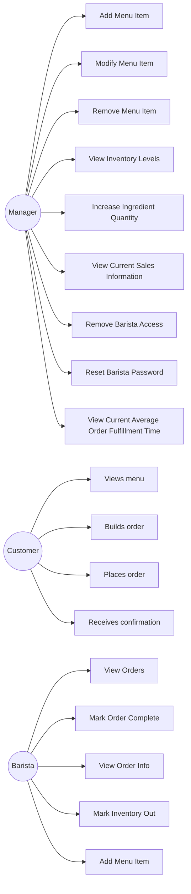

|Use case|Actor|Requirement|Where it came from|
|---|---|---|---|
|Add Menu Item|Manager|Manager adds menu item to list of current items|4.2|
|Modify Menu Item|Manager|Manager modfies menu item details|4.2|
|Remove Menu Item|Manager|Manager takes menu item off menu|4.2|
|View Inventory Levels|Manager|Manage views all ingrdeient quantity amount|custom|
|Increase Ingredient Quantity | Manager| Manager increases ingredient quantity|4.3|
|View Current Sales Information|Manager|Manager sees sales for day|4.5| 
|Remove Barista Access|Manager|Manager removes barista access|custom| 
|Reset Barista Password|Manager|Manager resets barista password|custom|
|View Current Average Order Fulfillment Time|Manager|Manager views current average order fulfillment Time|4.6|
|View Menu |Customer|2.1|Customer can look at the menu and see availability as well as prices|
|Build Order|Customer|2.2|Customer can build an order by adding and customizing|
|Place Order|Customer|2.5|Customer places the completed order|
|Receive Confirmation|Customer|2.5|Customer receives a confirmation/order number after placing the order|
|View Orders|Barista|Barista sees orders to make, as they are placed|3.1, 3.2|
|Mark Order Complete|Barista|Barista marks order as complete|3.3|
|View Order Info|Barista|Barista sees all order info|3.5|
|Mark Inventory Out|Barista|Barista tells system when inventory is out of item|3.6|
|Add Menu Item|Barista|Barista can add menu item|3.7|

functional requirements with no use case: Functional requirements with no use case: 2.3, 2.4, 2.6, 2.7, 4.3

## How We Got Here
We talked about what use case means and whether or not what "describes a screen instead of an outcome" and decided that describing a screen means getting so specific that if the use case starts describing something like a specific GUI element, it's a screen and not an outcome.

## Where We Disagreed
No real disagreements.

## What We're Not Sure About
If the manager should have a use case where they check notifications to see if there are any inventory levels that need to be replinished. Should the system tell the manager? Do we also need any clock in/out management system since the barista should have the ability to edit menu items when a manager is not there, but how would the system know a manager is not present?
