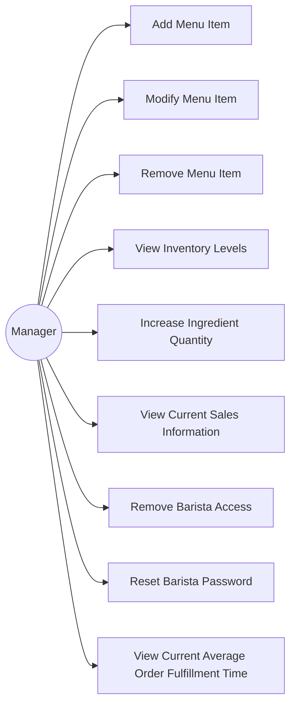

# Individual Sketch — Week [3] Round [2]
**Student:** [Salah Robleh]
**Date:** [9/10/2026]

---

## My Answer

*Respond directly to the prompt. Write in plain sentences — no need to be formal. You have 12 minutes total, so think first, then write.*

1. Actor that is Manager may add a menu item to current list of menu items
2. Actor that is Manager may modify menu item. This could be changing menu item name, price, ingredient cost, basically menu item specifics
3. Actor that is Manager has the ability to remove menu item from current list of menu items.
4. Actor that is Manager can view inventory levels
5. Actor that is Manager can add to current inventories's ingredients's quantity
6. Actor that is Manager can view current sales for that specfic day, which items were sold and their quantity, and how much money came in? Revenue or profit
7. Actor that is Manager can remove access for baristas that no longer work at that establishment
8. Actor that is Manager can view Barista's credentials and modify passwords for them
9. Actor that is Manager can view current average order fullfilment time.

---

## Diagram

*Include your Mermaid diagram below. If the prompt doesn't ask for a diagram, delete this section.*

---

## What I'm Not Sure About

*One or two sentences. What feels uncertain or wrong about what you just produced?*

[Pretty sure 4.4 is from the system and should not be a usecase and maybe when the manager logs in there are notifications for ingredients that are getting low in quantity]

---

**Commit this file before group discussion begins.**
